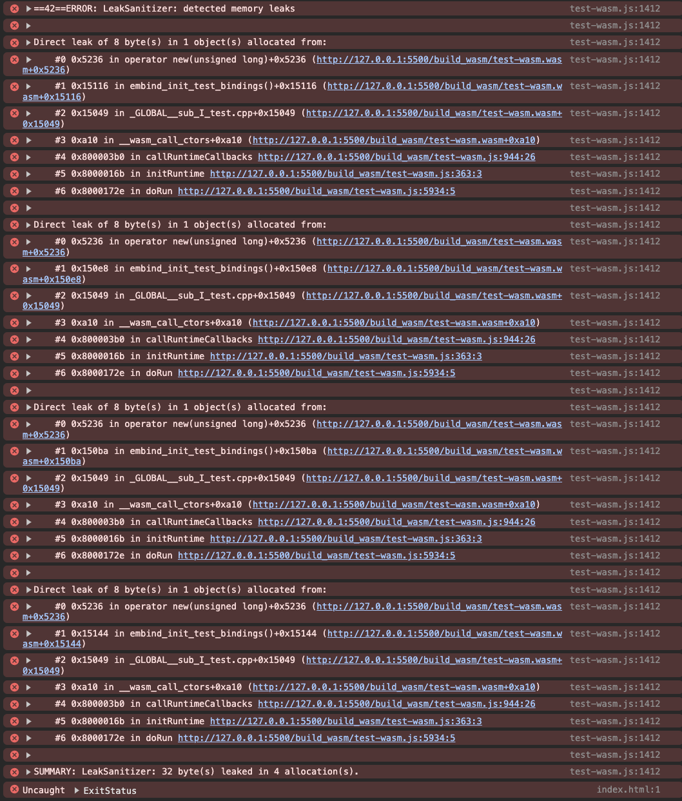

# WASM Emscripten memory leak

Unknown memory leak has been detected from `emscripten_class_function_binding`.

```cpp
EMSCRIPTEN_BINDINGS(test_bindings)
{
    class_<Test>("Test")
        .constructor(&Test ::create) // No Leak
        .function("test1", &Test::test1) // Leak 8 bytes
        .function("test2", &Test ::test2) // Leak 8 bytes
        .function("test3", &Test ::test3) // Leak 8 bytes
        .function("test4", &Test ::test4); // Leak 8 bytes

    emscripten::function("doLeakCheck", &__lsan_do_leak_check); // No Leak
}
```



## Run
```sh
npx light-server -s .
```

## Build
This repo requires [meson](https://mesonbuild.com/), [ninja](https://ninja-build.org/) for build steps.

```sh
rm -rf build_wasm && sh ./build.sh
```

## Environments
### Machine
```
Chip: Apple M1 Pro
macOS: Sonoma 14.1.2
```

### XCode
```
jinny  ~  xcodebuild -version

Xcode 15.3
Build version 15E204a
```

### emcc
```
jinny  ~  emcc -v

emcc (Emscripten gcc/clang-like replacement + linker emulating GNU ld) 3.1.56-git
clang version 19.0.0git
Target: wasm32-unknown-emscripten
Thread model: posix
InstalledDir: /opt/homebrew/Cellar/emscripten/3.1.56/libexec/llvm/bin
```